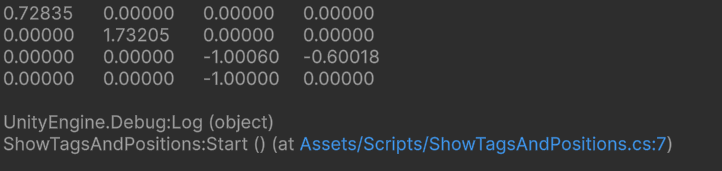
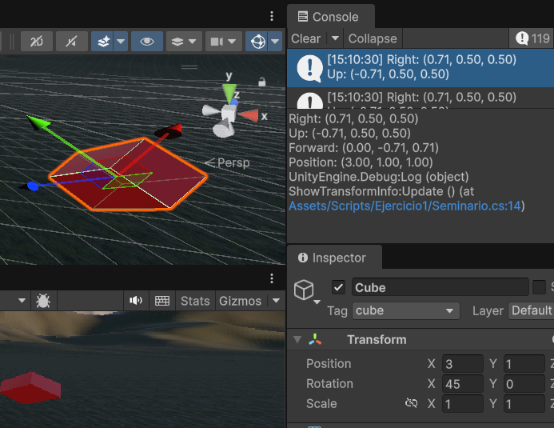

# Seminario: Mundos Virtuales – Introducción a la Programación de Gráficos 3D

## 1. Funciones de traslación, rotación y escalado en Unity

En Unity, las transformaciones geométricas se realizan mediante el componente **Transform**.
Principales funciones:

```csharp
// Traslación
transform.Translate(x, y, z);

// Rotación
transform.Rotate(x, y, z);
transform.rotation = Quaternion.Euler(x, y, z);

// Escalado
transform.localScale = new Vector3(x, y, z);
```

---

## 2. Orden de transformaciones: traslación y rotación de la cámara

```csharp
// A) Trasladar y luego rotar
transform.Translate(2, 2, 2);
transform.Rotate(0, 30, 0);

// B) Rotar y luego trasladar
transform.Rotate(0, 30, 0);
transform.Translate(2, 2, 2);
```

El resultado **no es el mismo**.
Las transformaciones **no conmutan**:

- En A, la cámara se mueve y luego gira sobre su nueva posicion.
- En B, primero se rota y luego se traslada según los ejes rotados.

## TODO ESCENAAAA

## 3. Esfera parcialmente recortada por el volumen de vista

Para que una esfera de radio 1 quede parcialmente dentro del volumen de vista:

```csharp
Camera.main.nearClipPlane = 1f;
Camera.main.farClipPlane = 3f;
```

Si la esfera está centrada en `z = 2`, los planos del frustum recortan parte de ella.

## TODO ESCENAAAA

## 4. Esfera fuera del campo de visión

Situar la esfera fuera del volumen de vista ajustando los planos de recorte:

```csharp
Camera.main.nearClipPlane = 1f;
Camera.main.farClipPlane = 1.5f;
```

La esfera a `z = 2` quedará completamente fuera de la vista y no será renderizada.

## TODO ESCENAAAA

## 5. Modificar el ángulo de visión de la cámara

```csharp
Camera.main.fieldOfView = 90f; // Aumentar FOV
Camera.main.fieldOfView = 30f; // Disminuir FOV
```

- Aumentar el **FOV** amplía el campo de visión, los objetos parecen más pequeños y distantes.
- Disminuirlo reduce el campo de visión, los objetos se ven más grandes y cercanos.

---

## 6. Proyección ortográfica

La afirmación es **correcta**.
Para realizar la proyección al espacio 2D sin perspectiva se cambia:

```csharp
Camera.main.orthographic = true;
```

En este modo, Se conservan medidas, no se almacena información de distancias. es apropiada para programas de diseño.

## TODO ESCENAAAA

---

## 7. Rotaciones con quaternions

Las rotaciones se pueden expresar con cuaterniones:

```csharp
transform.rotation = Quaternion.Euler(0, 30, 0);
```

Los **quaternions** representan rotaciones en el espacio 3D sin los problemas de bloqueo de ejes (gimbal lock), se basan en los números complejos.

---

## 8. Matriz de proyección en perspectiva

Se puede obtener en tiempo de ejecución mirando en el inspector de la propia cámara y buscando la propiedad projectionMatrix o accediendo a dicha propiedad en un script mediante

```csharp
Camera.main.projectionMatrix
GetComponent<Camera>().projectionMatrix
```

Asegurnadonos de que:

```csharp
Camera.main.orthographic = false;
```

---

## 9. Matriz de proyección ortográfica

De la misma forma que en el punto anteiror pero debemos asegurarnos de que:

```csharp
Camera.main.orthographic = true;
```

---

## 10. Matriz de transformación local ↔ global

Para pasar de local a global, usamos la propiedad:
[localToWorld](https://docs.unity3d.com/ScriptReference/Transform-localToWorldMatrix.html)
Matriz que transforma un punto del espacio local en espacio global (Solo lectura).

Para pasar de global a local, usamos la propiedad:
[worldToLocal](https://docs.unity3d.com/ScriptReference/Transform-worldToLocalMatrix.html)
Matriz que transforma un punto del espacio global en espacio local (Solo lectura).

---

## 11. Matriz de cambio al sistema de referencia de vista

Para obtener la matriz para cambiar al sistema de referencia de vista, miramos la propiedad:
[worldToCameraMatrix](https://docs.unity3d.com/ScriptReference/Camera-worldToCameraMatrix.html)

---

## 12. Matriz de proyección usada en ejecución

Agregamos esta línea de código al script de la práctica:

```csharp
Debug.Log(Camera.main.projectionMatrix);
```


Si analizamos esta un poco nos darémos cuenta de que la cámara utilizada en esta práctica fue una en perspectiva, ya que el campo (4,3), contando desde 1, de la matriz está a -1 y no a 0.

---

## 13. Matrices de modelo y vista de la escena

Agregamos las siguientes líneas de código al script de la práctica:

```csharp
// Matriz de vista
Debug.Log(Camera.main.worldToCameraMatrix);
// Matriz modelo, aplicado a cada objeto
Debug.Log(transform.localToWorldMatrix);
```

## TODO ESCENAAAAA

---

## 14. Rotación en Start y matriz mundial

Agregamos las siguientes líneas de código al script de la práctica:

```csharp
void Start() {
    transform.Rotate(0, 45, 0);
    Debug.Log(transform.localToWorldMatrix);
}
```

## TODO ESCENAAAA

---

## 15. Coordenadas con `Position(3,1,1)` y `Rotation(45,0,45)`

Teniendo en cuenta que en el enunciado nos dan los anteriores datos, se nos pide ver en relacion con el sistema global como esta situado el sistema de referencia de nuestro cubo, para eso haremos uso de las siguientes propiedades:

* [up](https://docs.unity3d.com/ScriptReference/Transform-up.html) El eje verde del transform en el espacio mundial.
* [forward](https://docs.unity3d.com/ScriptReference/Transform-forward.html) Devuelve un vector normalizado que representa el eje azul del transform en el espacio mundial.
* [right](https://docs.unity3d.com/ScriptReference/Transform-right.html) El eje rojo del transform en el espacio mundial.
```
M = T(3,1,1) · Rz(45°) · Rx(45°)
```

Se implementó el siguiente codigo con el fin de que saliera por pantalla las coordenadas de cada eje en el sistema global.

```csharp
using UnityEngine;

public class ShowTransformInfo : MonoBehaviour
{
    public Transform target;
    public float gizmoAxisLength = 1f;
    void Start()
    {
        target = transform;
    }
    void Update()
    {
        if (target == null)
        {
          return;
        }
        Debug.Log($"Right: {target.right}\nUp: {target.up}\nForward: {target.forward}\nPosition: {target.position}");
    }
}

```


---

## 16. Escena base y script de depuración

**Elementos de la escena:**

- Cámara principal
- Plano base (suelo)
- Tres cubos (rojo, verde, azul) en distintas posiciones

**Script de depuración:**

```
      y
      |
      |_____ x
     /
    z

Centro del cubo (0, 0, 0)
           +--------+
          /|       /|
         / |      / |
        +--------+  |
        |  +-----|--+ <- Vértice (0.5, 0.5, 0.5)
        | /      | /
        |/       |/
        +--------+
```

```csharp
using UnityEngine;

public class MatrixDebugger : MonoBehaviour {
    public Transform redCube, greenCube, blueCube;

    void Update() {
        Matrix4x4 view = Camera.main.worldToCameraMatrix;
        Matrix4x4 proj = Camera.main.projectionMatrix;

        Debug.Log("==== MATRICES ====");
        Debug.Log("View:\n" + view);
        Debug.Log("Projection:\n" + proj);
        foreach (Transform cube in new Transform[]{redCube, greenCube, blueCube}) {
            Matrix4x4 model = cube.localToWorldMatrix;
            Vector3 vertex = new Vector3(0.5f, 0.5f, 0.5f);
            Vector4 transformed = proj * view * model * new Vector4(vertex.x, vertex.y, vertex.z, 1);
            Debug.Log(cube.name + " vertex transformed: " + transformed);
        }
    }
}
```

## TODO ESCENAAAA

---

## 17. Recorrido de coordenadas de un vértice

**Ejemplo:** vértice `(0.5, 0.5, 0.5)` del cubo rojo

## TODOO Hacer dibujo en draw.io

---

## 18. Cambios en las matrices al mover o rotar

- **Mover o rotar un cubo:** cambia su matriz de **modelo (Model Matrix)**.
- **Rotar la cámara:** modifica la **matriz de vista (View Matrix)**.
- **Cambiar proyección ortográfica ↔ perspectiva:** altera la **matriz de proyección (Projection Matrix)**.

Comparando los valores en consola se puede observar cómo varían los coeficientes de cada matriz y su efecto en las coordenadas finales.

## TODO ESCENAAAA pantallazos

---

## Referencias

- Apuntes de clase: ResumenGraficos3D Geometría
- Documentación oficial Unity:
  [https://docs.unity3d.com/ScriptReference/Transform.html](https://docs.unity3d.com/ScriptReference/Transform.html)
  [https://docs.unity3d.com/ScriptReference/Camera.html](https://docs.unity3d.com/ScriptReference/Camera.html)

---

**Autor:**
Adrián García Rodríguez, Kyliam Gabriel Chinea Salcedo, Roberto Padrón Castañeda y Cristóbal Jesús Sarmiento Rodríguez

**Asignatura:** Grado en Ingeniería Informática
Interfaces Inteligentes

**Fecha:** 05/11/2025
